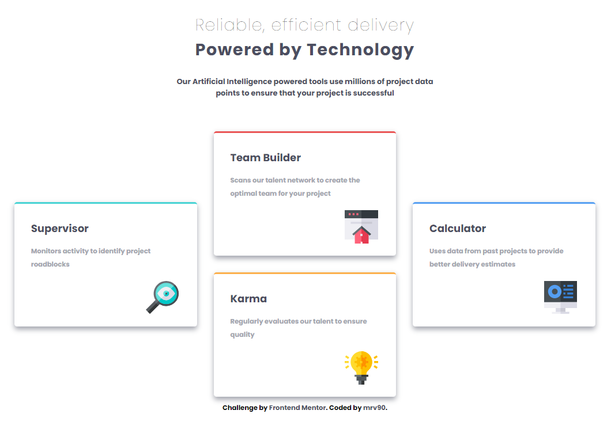

# Frontend Mentor - Four card feature section solution

This is a solution to the [Four card feature section challenge on Frontend Mentor](https://www.frontendmentor.io/challenges/four-card-feature-section-weK1eFYK). Frontend Mentor challenges help you improve your coding skills by building realistic projects. 

## Table of contents

- [Overview](#overview)
  - [The challenge](#the-challenge)
  - [Screenshot](#screenshot)
  - [Links](#links)
- [My process](#my-process)
  - [Built with](#built-with)
  - [What I learned](#what-i-learned)

## Overview
### The challenge
Users should be able to:
- View the optimal layout for the site depending on their device's screen size

### Screenshot

|  |  |
|--|--|
|  |  |

**Note: Delete this note and the paragraphs above when you add your screenshot. If you prefer not to add a screenshot, feel free to remove this entire section.**

### Links

- Solution URL: [github.com/mrv90/frontend-mentor_four-card-feature-section](https://github.com/mrv90/frontend-mentor_four-card-feature-section)
- Live Site URL: [mrv90.github.io/frontend-mentor_four-card-feature-section](https://mrv90.github.io/frontend-mentor_four-card-feature-section)

## My process

### Built with

- Semantic HTML5 markup
- CSS custom properties
- Flexbox
- CSS Grid
- Box-Shadow
- Mobile-first workflow

### What I learned

 - Using CSS Grid, when I want to make custom layout with not just simply n rows over m columns
 - Using Box-Shadow, to show some beautiful shadow over my cards
 - More proper usages of classes, on CSS!
